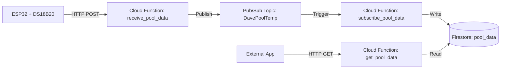

# DavePoolTemp

Wireless Pool temperature sensor that sends data to Google Cloud Platform (GCP) and provides a REST API for external applications.

## Architecture

The system consists of an ESP32 microcontroller reading a DS18B20 temperature sensor. It sends data via HTTP to a Cloud Function, which publishes it to Pub/Sub. A second function subscribes to the topic and stores the data in Firestore. A third function provides an API to retrieve the data.



## Hardware

-   **Microcontroller**: Wemos D1 Mini ESP32 (or generic ESP32)
-   **Sensor**: DS18B20 Waterproof Temperature Sensor
-   **Resistor**: 4.7kΩ Pull-up Resistor

### Wiring

| DS18B20 Wire | ESP32 Pin | Notes |
| :--- | :--- | :--- |
| Red (VCC) | 3.3V | |
| Black (GND) | GND | |
| Yellow (Data) | GPIO 4 (D2) | Connect 4.7kΩ resistor between Data and VCC |

## Firmware

### Setup (Arduino IDE)

1.  Open `src/DavePoolMonitor.ino` in the Arduino IDE.
2.  Install the following libraries via the Library Manager:
    -   `OneWire`
    -   `DallasTemperature`
    -   `ArduinoJson`
3.  Create a file named `secrets.h` in the `src` folder with your credentials:
    ```cpp
    #ifndef SECRETS_H
    #define SECRETS_H

    #define WIFI_SSID "YOUR_WIFI_SSID"
    #define WIFI_PASSWORD "YOUR_WIFI_PASSWORD"
    #define GCP_FUNCTION_URL "YOUR_GCP_FUNCTION_URL"
    #define API_KEY "YOUR_SHARED_SECRET"

    #endif
    ```

### Upload

1.  Select your board (e.g., Wemos D1 Mini ESP32) and port.
2.  Click the **Upload** button.
3.  Open the **Serial Monitor** (115200 baud) to view logs.

## Cloud Setup (GCP)

### Prerequisites

-   Google Cloud Project
-   `gcloud` CLI installed and authenticated
-   Firestore API enabled and Database created (Native mode)

### Configuration

Update `gcp/main.py` with your project details:

```python
API_KEY = "YOUR_SHARED_SECRET" # Must match firmware
PROJECT_ID = "YOUR_PROJECT_ID"
TOPIC_ID = "DavePoolTemp"
```

### Deployment

Deploy the three Cloud Functions using the following commands:

#### 1. Ingest Function (`receive_pool_data`)

Receives data from ESP32 and publishes to Pub/Sub.

```bash
gcloud functions deploy receive_pool_data \
  --gen2 \
  --runtime=python310 \
  --region=us-central1 \
  --source=./gcp \
  --entry-point=receive_pool_data \
  --trigger-http \
  --allow-unauthenticated
```

#### 2. Storage Function (`subscribe_pool_data`)

Subscribes to Pub/Sub and stores data in Firestore.

```bash
gcloud functions deploy subscribe_pool_data \
  --gen2 \
  --runtime=python310 \
  --region=us-central1 \
  --source=./gcp \
  --entry-point=subscribe_pool_data \
  --trigger-topic=DavePoolTemp
```

#### 3. Retrieval API (`get_pool_data`)

Provides an HTTP API to retrieve data from Firestore.

```bash
gcloud functions deploy get_pool_data \
  --gen2 \
  --runtime=python310 \
  --region=us-central1 \
  --source=./gcp \
  --entry-point=get_pool_data \
  --trigger-http \
  --allow-unauthenticated
```

## API Usage

Retrieve the latest pool temperature data:

**Endpoint**: `https://us-central1-YOUR_PROJECT_ID.cloudfunctions.net/get_pool_data`

**Parameters**:
-   `api_key`: Your shared secret.
-   `limit`: (Optional) Number of records to return (default: 100).

**Example**:

```bash
curl "https://us-central1-davepooltemp.cloudfunctions.net/get_pool_data?api_key=YOUR_SHARED_SECRET&limit=5"
```

**Response**:

```json
[
  {
    "device_id": "pool-monitor-01",
    "temperature_c": 25.5,
    "temperature_f": 77.9,
    "timestamp": "2023-10-27T10:00:00.000000Z"
  }
]
```
